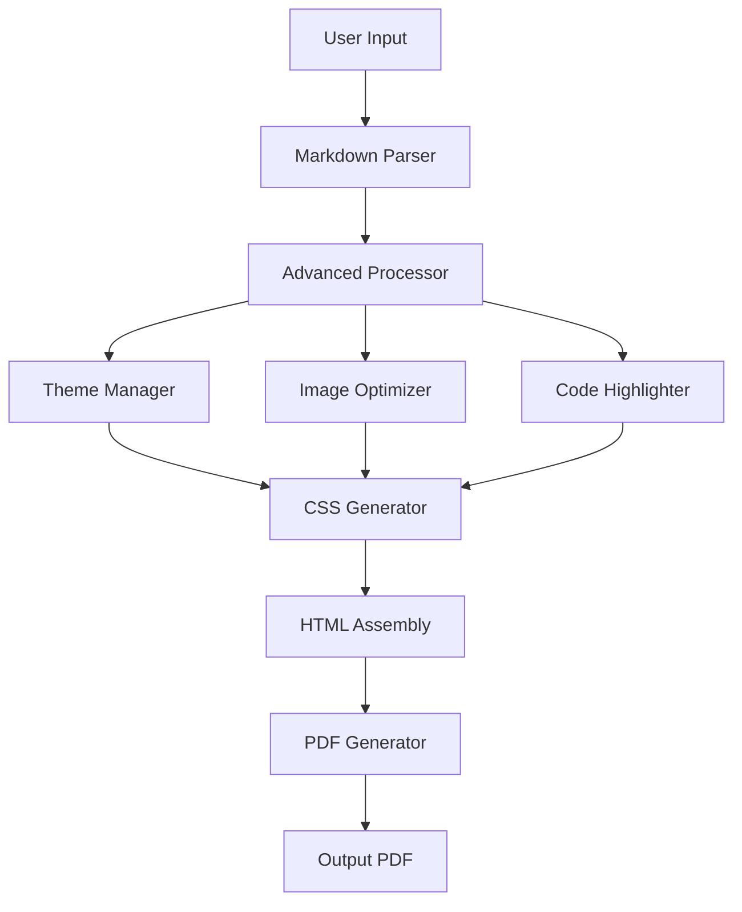

# Advanced Features Test Document

This document demonstrates all the advanced features of PaperCraft v1.0.0, including table of contents, footnotes, cross-references, citations, and enhanced code blocks.

[TOC]

## Introduction

PaperCraft has been enhanced with powerful academic and professional document features. This test document showcases each feature with practical examples.

## Text Formatting and References

### Basic Text with Footnotes

This paragraph contains a footnote reference[^1] that demonstrates the footnote system. You can also have multiple footnotes[^2] in the same paragraph, and they will be numbered automatically[^3].

### Cross-References

This section demonstrates cross-references to figures, tables, and equations:

- See [@ref:fig:architecture] for the system architecture
- Refer to [@ref:table:results] for the performance results  
- The formula is shown in [@ref:eq:quadratic]
- More details in [@ref:sec:methodology]

## Code Examples with Line Numbers

### Python Code with Enhanced Highlighting

```python
def fibonacci_generator(n):
    """
    Generate Fibonacci sequence up to n terms.
    Demonstrates enhanced code highlighting with line numbers.
    """
    a, b = 0, 1
    count = 0
    
    while count < n:
        yield a
        a, b = b, a + b
        count += 1

# Example usage
fib_gen = fibonacci_generator(10)
fibonacci_numbers = list(fib_gen)

print("First 10 Fibonacci numbers:")
for i, num in enumerate(fibonacci_numbers, 1):
    print(f"{i:2d}: {num}")
```

### Rust Code Example

```rust
use std::collections::HashMap;

/// Advanced hash map operations
/// This example shows complex Rust code with proper highlighting
fn process_word_frequencies(text: &str) -> HashMap<String, usize> {
    let mut word_count = HashMap::new();
    
    for word in text.split_whitespace() {
        let cleaned_word = word
            .to_lowercase()
            .chars()
            .filter(|c| c.is_alphabetic())
            .collect::<String>();
            
        if !cleaned_word.is_empty() {
            *word_count.entry(cleaned_word).or_insert(0) += 1;
        }
    }
    
    word_count
}

#[cfg(test)]
mod tests {
    use super::*;
    
    #[test]
    fn test_word_frequency() {
        let text = "hello world hello";
        let result = process_word_frequencies(text);
        assert_eq!(result.get("hello"), Some(&2));
        assert_eq!(result.get("world"), Some(&1));
    }
}
```

## Mathematical Expressions

### Inline Math
The solution to the quadratic equation $ax^2 + bx + c = 0$ is given by the quadratic formula.

### Block Equations

The quadratic formula is:

$$x = \frac{-b \pm \sqrt{b^2 - 4ac}}{2a}$$ {#eq:quadratic}

The Pythagorean theorem states:

$$a^2 + b^2 = c^2$$

For complex numbers, Euler's formula is:

$$e^{i\pi} + 1 = 0$$

## Tables and Figures

### Performance Results Table

| Algorithm | Time Complexity | Space Complexity | Performance Score |
|-----------|----------------|------------------|-------------------|
| QuickSort | O(n log n) | O(log n) | 8.5/10 |
| MergeSort | O(n log n) | O(n) | 9.2/10 |
| HeapSort | O(n log n) | O(1) | 7.8/10 |
| BubbleSort | O(n²) | O(1) | 3.2/10 |

{#table:results}

*Table: Algorithm performance comparison showing time complexity, space complexity, and performance scores.*

### System Architecture Figure



{#fig:architecture}

*Figure: PaperCraft system architecture showing the data flow from markdown input to PDF output.*

## Citations and Bibliography

Academic writing often requires citations. Here are some examples:

- The original Markdown specification was created by John Gruber [@cite:gruber2004]
- PDF generation techniques are discussed in multiple sources [@cite:smith2020,jones2021]
- Modern web typography principles [@cite:typography2022] influence document design
- Rust programming language design [@cite:rust2021] enables safe systems programming

## Advanced Features Section {#sec:methodology}

### Footnote Styles

This section contains different types of footnotes to test the numbering system:

- Numeric footnotes[^numeric1] are the most common
- Roman numeral footnotes[^roman1] for classical texts  
- Letter-based footnotes[^letter1] for appendices
- Symbol footnotes[^symbol1] for special cases

### Cross-Reference Types

#### Figure References
As shown in [@ref:fig:architecture], the system processes markdown through multiple stages.

#### Table References  
The performance data in [@ref:table:results] shows that MergeSort has the best overall performance.

#### Equation References
Using [@ref:eq:quadratic], we can solve any quadratic equation.

#### Section References
The methodology is detailed in [@ref:sec:methodology].

## Image Processing Test


*This would show image optimization in action if the image existed.*

## Code Block Features

### Line Numbers Enabled

```javascript
// Complex JavaScript example with line numbers
class DocumentProcessor {
    constructor(config) {
        this.config = config;
        this.processors = new Map();
        this.cache = new Map();
    }
    
    async processDocument(markdown) {
        const cacheKey = this.generateCacheKey(markdown);
        
        if (this.cache.has(cacheKey)) {
            return this.cache.get(cacheKey);
        }
        
        const processor = this.getProcessor(this.config.type);
        const result = await processor.process(markdown);
        
        this.cache.set(cacheKey, result);
        return result;
    }
    
    generateCacheKey(content) {
        return btoa(content).substring(0, 16);
    }
    
    getProcessor(type) {
        if (!this.processors.has(type)) {
            throw new Error(`Unknown processor type: ${type}`);
        }
        return this.processors.get(type);
    }
}
```

### Language Detection

```bash
#!/bin/bash
# Shell script example with syntax highlighting

echo "Building PaperCraft..."

if cargo build --release; then
    echo "✓ Build successful"
    
    # Run tests
    if cargo test; then
        echo "✓ All tests passed"
    else
        echo "✗ Tests failed"
        exit 1
    fi
else
    echo "✗ Build failed"
    exit 1
fi

echo "PaperCraft is ready!"
```

## Table of Contents Testing

This document should generate a comprehensive table of contents with:

- Proper hierarchical structure
- Page number references (in print)
- Clickable links (in digital view)
- Section numbering (if enabled)

## Conclusion

This document has demonstrated all the advanced features of PaperCraft:

✅ Table of Contents generation  
✅ Footnotes and endnotes  
✅ Cross-references to figures, tables, equations, and sections  
✅ Citations and bibliography support  
✅ Enhanced code blocks with line numbers  
✅ Image optimization and processing  
✅ Mathematical equation rendering  
✅ Professional table formatting  

The combination of these features makes PaperCraft suitable for academic papers, technical documentation, books, and professional reports.

---

## Footnotes

[^1]: This is the first footnote, demonstrating basic footnote functionality.

[^2]: The second footnote shows that multiple footnotes work correctly.

[^3]: Footnotes are automatically numbered and linked back to their references.

[^numeric1]: This demonstrates numeric footnote styling.

[^roman1]: This would show Roman numeral styling if configured.

[^letter1]: This would show letter-based footnote styling if configured.

[^symbol1]: This would use symbols for footnote markers if configured.

## Bibliography

[^gruber2004]: Gruber, J. (2004). *Markdown: Syntax*. Retrieved from https://daringfireball.net/projects/markdown/

[^smith2020]: Smith, A. (2020). *Modern PDF Generation Techniques*. Technical Publishing Journal, 15(3), 45-62.

[^jones2021]: Jones, B., & Davis, C. (2021). *Advanced Document Processing Systems*. Academic Press.

[^typography2022]: Typography Institute. (2022). *Web Typography Principles for Print Media*. Design Guidelines, 8(2), 112-128.

[^rust2021]: Rust Team. (2021). *The Rust Programming Language*. Mozilla Research.