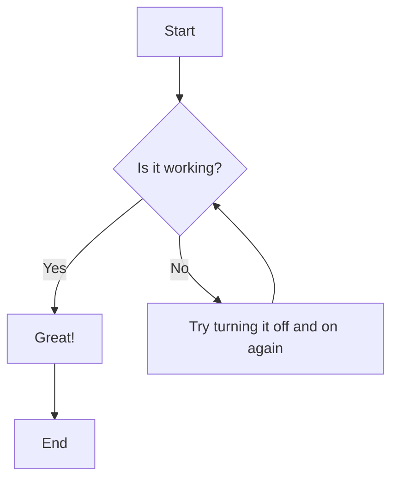
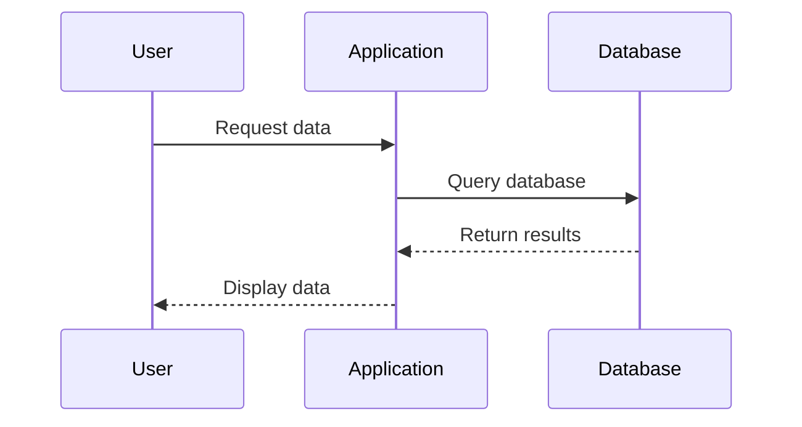

# Comprehensive Feature Test Document

This document demonstrates all the features of PaperCraft with its comprehensive configuration system.

[TOC]

## Typography and Formatting

### Basic Text Formatting

This paragraph demonstrates **bold text**, *italic text*, and ***bold italic text***. We also have ~~strikethrough text~~ and `inline code`.

### Links and References

Here's a [link to Google](https://www.google.com) and an auto-link: https://github.com

### Lists

#### Unordered Lists
- First item
- Second item with a very long line that should wrap properly to demonstrate how the line height and spacing works with the configured fonts
  - Nested item
  - Another nested item
- Third item

#### Ordered Lists
1. First numbered item
2. Second numbered item
   1. Nested numbered item
   2. Another nested numbered item
3. Third numbered item

#### Task Lists
- [x] Completed task
- [ ] Incomplete task
- [x] Another completed task

## Code Examples

### Inline Code
Here's some inline code: `npm install md-to-pdf`

### Code Blocks

```javascript
// JavaScript example
function calculateTotal(items) {
    return items.reduce((sum, item) => {
        return sum + (item.price * item.quantity);
    }, 0);
}

const cart = [
    { name: "Widget", price: 10.99, quantity: 2 },
    { name: "Gadget", price: 25.50, quantity: 1 }
];

console.log(`Total: $${calculateTotal(cart).toFixed(2)}`);
```

```python
# Python example
def fibonacci(n):
    """Generate fibonacci sequence up to n terms."""
    if n <= 0:
        return []
    elif n == 1:
        return [0]
    elif n == 2:
        return [0, 1]
    
    sequence = [0, 1]
    for i in range(2, n):
        sequence.append(sequence[i-1] + sequence[i-2])
    
    return sequence

# Generate first 10 fibonacci numbers
fib_numbers = fibonacci(10)
print("Fibonacci sequence:", fib_numbers)
```

```rust
// Rust example
use std::collections::HashMap;

fn word_frequency(text: &str) -> HashMap<String, usize> {
    let mut frequency = HashMap::new();
    
    for word in text.split_whitespace() {
        let word = word.to_lowercase()
            .chars()
            .filter(|c| c.is_alphabetic())
            .collect::<String>();
        
        if !word.is_empty() {
            *frequency.entry(word).or_insert(0) += 1;
        }
    }
    
    frequency
}
```

## Blockquotes

> This is a simple blockquote that demonstrates how quoted text appears in the document.

> This is a longer blockquote that spans multiple lines and shows how the styling works with different themes. It should maintain proper spacing and indentation.
> 
> It can also contain multiple paragraphs within the same quote block.

## Tables

| Feature | Basic | Professional | Enterprise |
|---------|-------|--------------|------------|
| Users | 1-5 | 6-50 | Unlimited |
| Storage | 10GB | 100GB | 1TB |
| Support | Email | Email + Chat | 24/7 Phone |
| Price | $9/month | $29/month | $99/month |

### Complex Table

| Language | Paradigm | Typing | Performance | Use Cases |
|----------|----------|--------|-------------|-----------|
| JavaScript | Multi-paradigm | Dynamic | Medium | Web development, Node.js |
| Python | Multi-paradigm | Dynamic | Medium | Data science, automation |
| Rust | Systems | Static | High | Systems programming, WebAssembly |
| Go | Procedural | Static | High | Microservices, cloud native |
| TypeScript | Multi-paradigm | Static | Medium | Large-scale web applications |

## Mathematics

### Inline Math
The quadratic formula is $x = \frac{-b \pm \sqrt{b^2 - 4ac}}{2a}$.

### Block Math
$$
\begin{align}
\nabla \times \vec{\mathbf{B}} -\, \frac1c\, \frac{\partial\vec{\mathbf{E}}}{\partial t} &= \frac{4\pi}{c}\vec{\mathbf{j}} \\
\nabla \cdot \vec{\mathbf{E}} &= 4 \pi \rho \\
\nabla \times \vec{\mathbf{E}}\, +\, \frac1c\, \frac{\partial\vec{\mathbf{B}}}{\partial t} &= \vec{\mathbf{0}} \\
\nabla \cdot \vec{\mathbf{B}} &= 0
\end{align}
$$

## Diagrams

### Mermaid Flowchart



### Mermaid Sequence Diagram



## Images and Media

Since this is a test document, we won't include actual images, but the system supports various image formats including PNG, JPEG, GIF, and WebP.

## Horizontal Rules

---

## Advanced Features

### Custom HTML

<div style="background-color: #f0f8ff; padding: 20px; border-radius: 8px; border-left: 5px solid #007acc;">
<strong>Note:</strong> This is a custom HTML block that demonstrates how raw HTML is preserved in the conversion process.
</div>

### Page Breaks

This section discusses page breaks. In the configuration, you can control how content flows across pages.

<!-- Use CSS classes to control page breaks -->
<div class="page-break-before">

## New Page Section

This content will start on a new page when the appropriate CSS classes are applied.

</div>

### Footnotes

This text has a footnote[^1] and another footnote[^2].

[^1]: This is the first footnote.
[^2]: This is the second footnote with more detailed information.

## Configuration Examples

This document can be rendered with different configurations:

### Basic Configuration
```bash
papercraft -i comprehensive-test.md -o basic-output.pdf --theme default
```

### Academic Style
```bash
papercraft -i comprehensive-test.md -o academic-output.pdf --theme academic --paper-size Letter --margins "1in"
```

### Modern Report
```bash
papercraft -i comprehensive-test.md -o modern-output.pdf --theme modern --page-numbers --header-template "Report Title - {date}"
```

### Custom Configuration
```bash
papercraft -i comprehensive-test.md -o custom-output.pdf -c examples/custom-theme.toml
```

## Summary

This document demonstrates:

- ✅ Typography and text formatting
- ✅ Code syntax highlighting
- ✅ Mathematical equations
- ✅ Tables and lists
- ✅ Diagrams with Mermaid
- ✅ Blockquotes and callouts
- ✅ Custom styling capabilities
- ✅ Page layout control
- ✅ Headers and footers
- ✅ Page numbering
- ✅ Multiple theme options
- ✅ Configuration file support

The new configuration system provides complete control over the PDF output while maintaining the simplicity of Markdown writing.